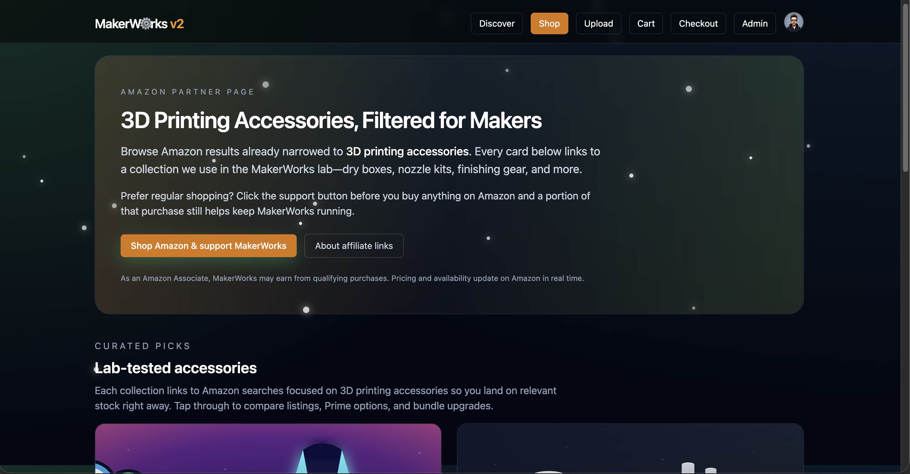
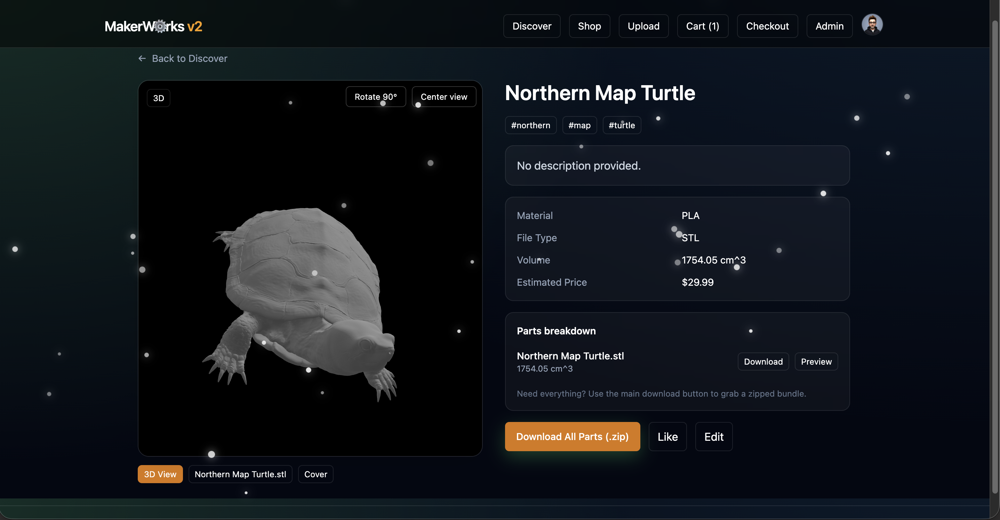
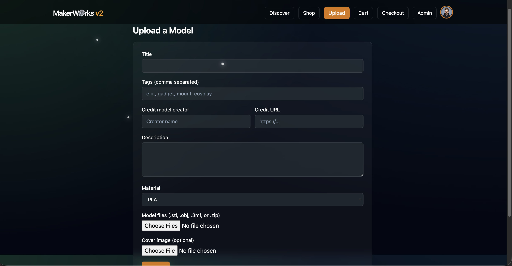
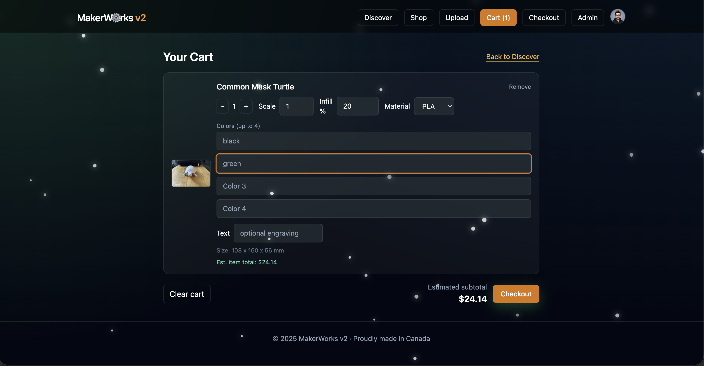
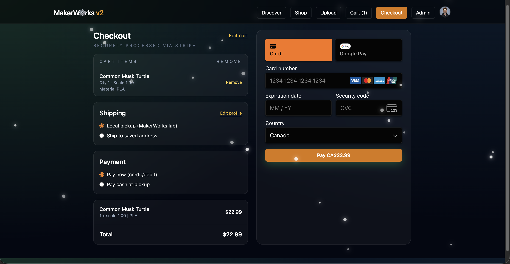
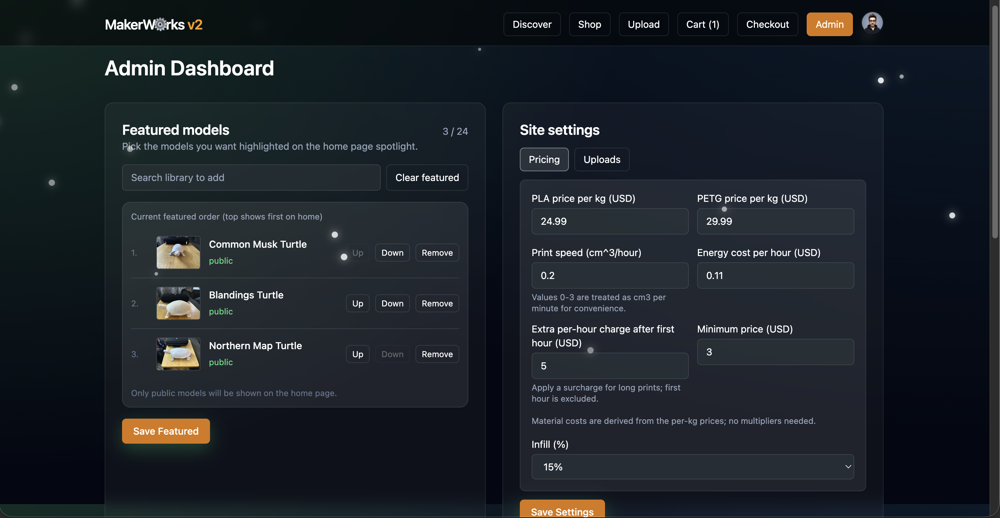
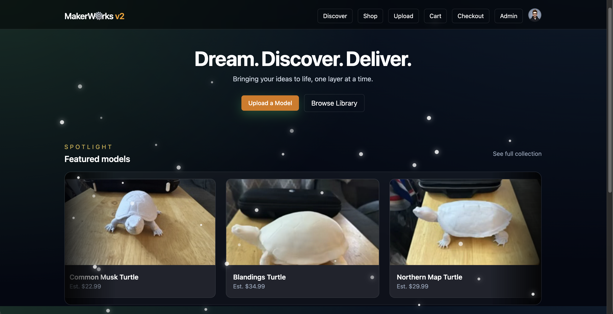

MakerWorks v2 - self-hosted 3D print hub

MakerWorks v2 is a self-hosted library for sharing printable models, estimating print jobs, and (optionally) taking payments. This page is a user guide for the Unraid Community Applications listing.

What you get
- Upload STL/OBJ/3MF files with optional cover images; STL files preview in-browser.
- Automatic weight and cost estimator with material and color options; Stripe checkout stays inside the app when enabled.
- Personal profile pages (`/u/{slug}`) plus featured models curated by admins.
- Admin dashboard for pricing, site settings, backups, and optional OrderWorks webhook retries.
- Email verification for new signups and a bootstrap admin account set via container variables.

Interface highlights

After you install from Community Applications
- Set the storage path to a persistent share (e.g., `/mnt/user/makerworks/storage`).
- Point `DATABASE_URL` to your Postgres 15+ instance.
- Set `BASE_URL` to the public URL users will visit and `JWT_SECRET` to a long random string.
- Define `ADMIN_EMAIL` / `ADMIN_PASSWORD` to seed the first admin user (created on first start).
- Optional: add Stripe keys (`STRIPE_SECRET_KEY`, `NEXT_PUBLIC_STRIPE_PUBLISHABLE_KEY`) for payments and SMTP settings for verification emails.
- Optional: if you expose a direct hostname (bypassing Cloudflare/Tunnels) for uploads, enter it under Admin > Site Settings > Uploads so the UI can post large files straight to that path.

Brand it for your shop
- Set `NEXT_PUBLIC_BRAND_NAME` to your print service's public name (e.g., `NEXT_PUBLIC_BRAND_NAME="Print Foundry"`).
- Adjust or clear `NEXT_PUBLIC_BRAND_VERSION` if you do not want the default `v2` suffix shown next to the logo.
- Override `NEXT_PUBLIC_BRAND_LAB_NAME` (defaults to `<brand> lab`) to change the lab/pickup wording in checkout copy.
- Update `NEXT_PUBLIC_BRAND_HANDLE` if you prefer a different default handle in the social profile placeholders.

First login & setup
- Sign in with the admin email/password you set; this account is already verified.
- Open Admin > Site Settings to set your shop name, currency, and price adjustments.
- Add spool costs and optional color surcharge rates in Admin > Pricing so estimates match your material costs.
- Connect Stripe in the env vars to enable checkout, or leave blank to use MakerWorks as a catalog only.
- If you use OrderWorks, add the webhook URL/secret in the admin panel to forward new jobs.

Daily use
- Upload models from the Upload page (supports STL, OBJ, 3MF) and optionally add a cover image; STL files render in a 3D viewer.
- Each model gets a shareable page; `/u/{slug}` lists a user's uploads and `/me` jumps to your own page.
- Carts show weight, material choice (PLA/PETG), and estimated time/energy costs; Stripe's Payment Element keeps checkout on-site when configured.
- Users receive a verification link by email and can resend it from the signup screen.

Backups & restore
- In Admin > Backups create a snapshot of the database and uploads; files land under `/files/backups/<timestamp>/` on your storage share.
- Restore from the same card when needed; the app restarts to apply the snapshot. Keep your storage share backed up regularly.

Updating
- In Unraid, stop the container, click Update on MakerWorks v2, then start it again. Data persists through the mapped storage path and your database.

Environment variables (what they do)
- `DATABASE_URL` (required): Postgres connection string the app uses.
- `JWT_SECRET` (required): long random string to sign sessions.
- `BASE_URL` (required): public URL of the app (used for links/cookies).
- `STORAGE_DIR`: in-container storage path; leave `/app/storage` for Unraid.
- `DIRECT_UPLOAD_URL`: optional base URL just for `/api/upload` (e.g., `https://upload.example.com`) when you expose a non-Cloudflare hostname for large files.
- `ADMIN_EMAIL`, `ADMIN_PASSWORD`, `ADMIN_NAME`: seeds the first admin on start (email + password required).
- `PRINTER_PROFILE`: base printer preset (`BAMBU_X1C` default) - see the table below for more options and their assumptions.
- `PRINTER_ELECTRIC_RATE_PER_KWH`: override kWh cost if your power rate differs.
- Pricing (USD defaults): `PLA_PRICE_PER_KG_USD`, `PETG_PRICE_PER_KG_USD`, `NEXT_PUBLIC_PLA_PRICE_PER_KG`, `NEXT_PUBLIC_PETG_PRICE_PER_KG`.
- Optional CAD overrides: `PLA_PRICE_PER_KG_CAD`, `PETG_PRICE_PER_KG_CAD`, `ENERGY_CAD_PER_HOUR`, `MINIMUM_PRICE_CAD`, `EXTRA_HOURLY_AFTER_FIRST_USD`, `EXTRA_HOURLY_AFTER_FIRST_CAD`.
- Color surcharge: `COLOR_SURCHARGE_RATE` (server) and `NEXT_PUBLIC_COLOR_SURCHARGE_RATE` (UI).
- Currency labels: `CURRENCY` and `NEXT_PUBLIC_CURRENCY` (`USD` or `CAD`).
- Stripe (optional): `STRIPE_SECRET_KEY`, `NEXT_PUBLIC_STRIPE_PUBLISHABLE_KEY`.
- OrderWorks webhook (optional): `ORDERWORKS_WEBHOOK_URL`, `ORDERWORKS_WEBHOOK_SECRET`.
- Holiday theming (optional): `HOLIDAY_THEME`, `NEXT_PUBLIC_HOLIDAY_THEME` set to `christmas`, `halloween`, or `easter`.
- Contact/referral (optional): `NEXT_PUBLIC_AMAZON_TAG`, `NEXT_PUBLIC_AMAZON_DOMAIN`, `NEXT_PUBLIC_CONTACT_EMAIL`.
- Branding: `NEXT_PUBLIC_BRAND_NAME`, `NEXT_PUBLIC_BRAND_VERSION`, `NEXT_PUBLIC_BRAND_LAB_NAME`, `NEXT_PUBLIC_BRAND_HANDLE` (leave `NEXT_PUBLIC_BRAND_VERSION` blank to hide the suffix).
- SMTP (optional but recommended): `SMTP_HOST`, `SMTP_PORT`, `SMTP_USER`, `SMTP_PASSWORD`, `SMTP_SECURE`, `RECEIPT_FROM_EMAIL`, `RECEIPT_REPLY_TO_EMAIL`.
- Discord (optional): `DISCORD_BOT_TOKEN`, `DISCORD_CHANNEL_ID` for announcements; `DISCORD_ADMIN_BOT_TOKEN`, `DISCORD_ADMIN_CHANNEL_ID` for admin alerts.

Printer profiles (speed/cost assumptions)
Key | Printer / notes | Flow assumption | cm^3/hr throughput | Energy USD/hr*
--- | --- | --- | --- | ---
`BAMBU_X1C` | Bambu Lab X1 Carbon - CoreXY AMS flagship | 32 mm^3/s @ 65% | 74.88 | 0.0490
`BAMBU_P1S` | Bambu Lab P1S/P1P - AMS lite ready | 28 mm^3/s @ 65% | 65.52 | 0.0448
`PRUSA_MK4` | Prusa MK4 - input-shaper bedslinger | 16 mm^3/s @ 60% | 34.56 | 0.0364
`PRUSA_MK3S` | Prusa MK3S+ - classic bedslinger | 11 mm^3/s @ 55% | 21.78 | 0.0322
`CREALITY_K1_MAX` | Creality K1 Max - enclosed CoreXY | 30 mm^3/s @ 60% | 64.80 | 0.0588
`CREALITY_ENDER3_V2` | Creality Ender 3 V2/Neo - tuned bowden | 9 mm^3/s @ 55% | 17.82 | 0.0308
`ANYCUBIC_KOBRA2` | Anycubic Kobra 2 - high-flow bedslinger | 20 mm^3/s @ 60% | 43.20 | 0.0490
`GENERIC_FDM` | Generic 0.4 mm FDM - safe default for slower rigs | 8 mm^3/s @ 55% | 15.84 | 0.0308

*Energy cost figures assume the default `$0.14/kWh` rate; override with `PRINTER_ELECTRIC_RATE_PER_KWH` if your utility price is different.

Running outside Unraid (optional)
- Copy `.env.example` to `.env`, set the same variables, then run `docker-compose up --build` to start the app and Postgres locally. The app lives at `http://localhost:3000/`.

Support
- Issues and questions: https://github.com/schartrand77/mkw2/issues
