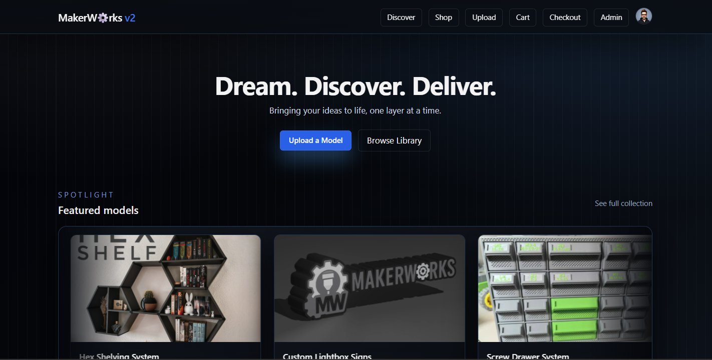
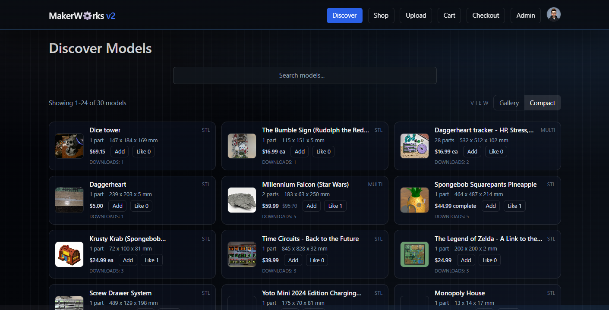
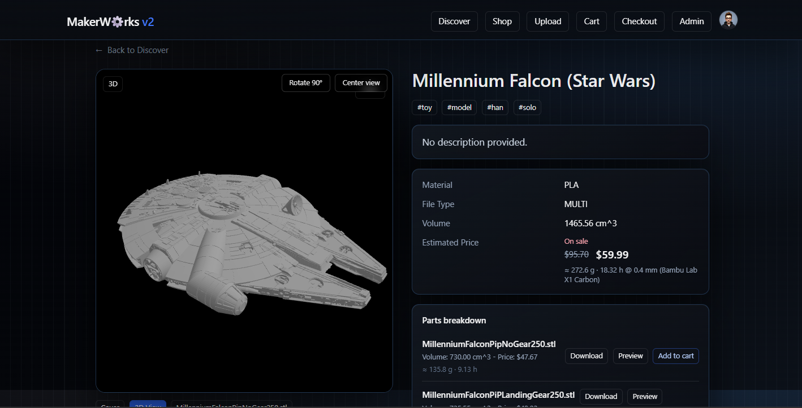
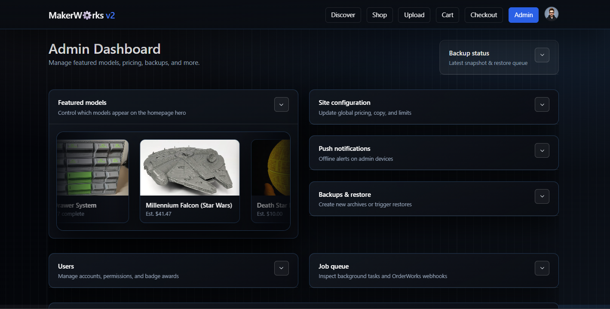

MakerWorks v2 - simple 3D print shop hub

MakerWorks v2 helps a print shop organize 3D models, give customers clear price estimates, and keep orders moving. It is meant to be run by a shop owner and used by customers who want to upload files and place print requests.

What this app does (plain language)
- Collects 3D print files (STL, OBJ, 3MF) in one place.
- Shows a preview of the model and a shareable page for each item.
- Estimates material use, print time, and price based on your settings.
- Lets customers request prints and pay online (optional).
- Gives you an admin area to review jobs, update pricing, and manage settings.

How OrderWorks fits in
OrderWorks is the production side. When a customer checks out, MakerWorks records the job and can send the details to OrderWorks so your team can schedule and produce the print. Status updates from OrderWorks can also be pushed back into MakerWorks so the job list stays current.

How StockWorks fits in
StockWorks is the inventory side. It can be connected to the same database so your material usage and stock levels stay in sync with the jobs coming from MakerWorks. This helps you track what you have on hand without double entry.

Who this is for
- Print shops that want a simple customer-facing catalog and checkout
- Makerspaces or schools that want a controlled way for members to request prints
- Teams that want to keep orders, pricing, and inventory in one workflow

Quick start (high level)
- Install the app and point it at your Postgres database.
- Set your shop name, pricing, and materials.
- Optionally add Stripe keys to accept payments.
- If you use OrderWorks or StockWorks, connect them to the same database.

Security notes (recent)
- Auth endpoints now enforce rate limiting and lockout windows. Configure via `AUTH_LOGIN_RATE_*`, `AUTH_REGISTER_RATE_*`, and `AUTH_RESEND_RATE_*` in `.env`.
- Admin invites use a magic login link (no shared invite password).
- Email verification tokens are stored hashed at rest.

Screenshots

Need help
- Issues and questions: https://github.com/schartrand77/mkw2/issues
